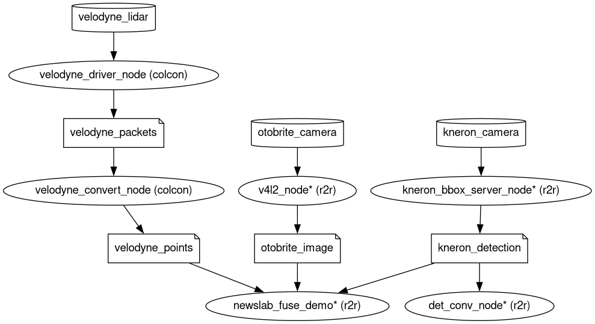

# Architecture

## Nodes

- `velodyne_driver_node`, `velodyne_convert_node`:

  These nodes provided by
  [`velodyne`](https://github.com/ros-drivers/velodyne) package scans
  and converts the point cloud stream from a lidar sensor.

- `kneron_bbox_server_node`

  This node reads bounding box stream from the Kneron camera.

- `v4l2_node`

  This node reads video stream from the Otobrite camera.

- `newslab_fuse_demo`

  This node gathers input sensor data and fuse them together, and
  shows the results in prompted windows.

- `det_conv_node`

  This node demonstrates message type conversions to Autoware
  messages.

## Topics

- `velodyne_packets` (velodyne_msgs/VelodyneScan) serves raw lidar
  packets scanned from the NIC.
- `velodyne_points` (sensor_msgs/msg/PointCloud2) serves lidar point
  cloud in Cartesian coordinates.
- `kneron_detection` (vision_msgs/msg/Detection2DArray) serves object
  bounding boxes from the Kneron camera.
- `otobrite_image` (sensor_msgs/msg/Image) serves images captured from
  the Otobrite camera.

## Devices

- Velodyne lidar communicates through the Ethernet interface I.
  - The static IP 192.168.10.10 is assigned to the lidar.
  - The static IP 192.168.10.1 is assigned to host NIC.

- Kneron camera communicates through the Ethernet interface II.
  - The static IP 172.23.230.84 is assigned to the camera.
  - The static IP 172.23.230.100 is assigned to the host NIC.

- Otobrite camera communicates through the USB 3.0 cable. The v4l2
  interface is used on the system. The device path is assumed to be
  `/dev/video0` in configuration files.
